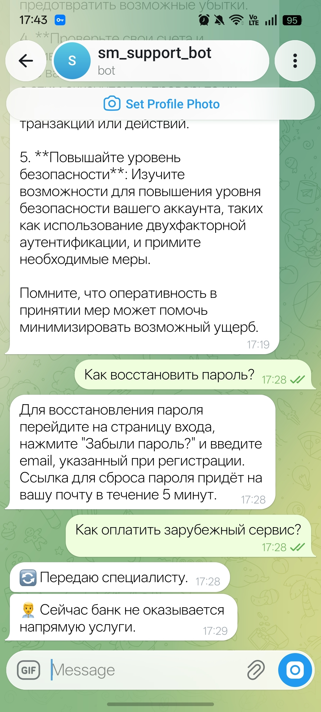
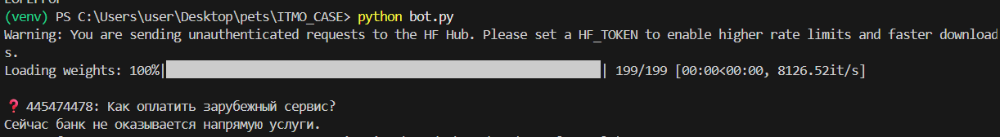
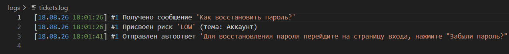

# Ticket Support Bot

**PoC автоматизации обработки тикетов поддержки.**

---

## Сценарии

1. **Happy Path**  
   Вопрос: *"Как восстановить пароль?"*  
   → Автоответ из базы знаний.

2. **Fallback Path**  
   Вопрос: *"Как оплатить зарубежный сервис?"*  
   → Эскалация оператору.

---

## Запуск

```bash
pip install -r requirements.txt
python indexer.py
python bot.py


## Демонстрация


**Пользователь пишет 2 вопроса: простой (happy path) и сложный, требующий эскалации.**



**На сложный отвечает поддержка.**



**Все события записываются в лог.**


