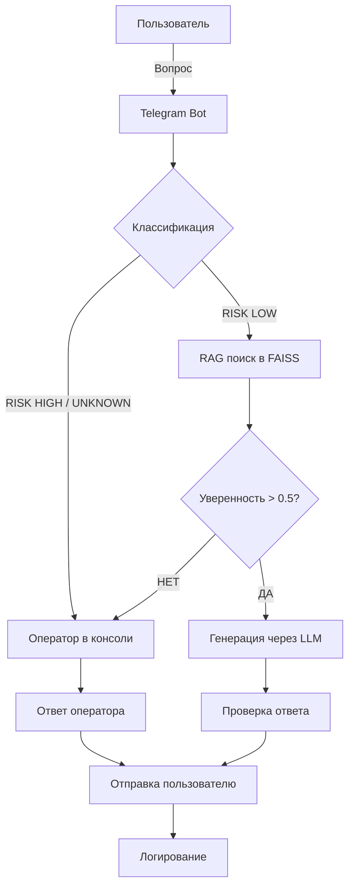

# Архитектура системы

## Целевая архитектура

### Компоненты

| Компонент | Технология | Назначение |
|-----------|------------|------------|
| **Telegram Bot** | pyTelegramBotAPI | Интерфейс пользователя |
| **Классификатор** | Rule-based (в PoC) / ML (в проде) | Определение темы и риска |
| **RAG Engine** | SentenceTransformers + FAISS | Поиск в базе знаний |
| **LLM** | Ollama (qwen2.5:3b) | Генерация ответа |
| **Очередь** | In-memory (в PoC) / Kafka (в проде) | Буферизация запросов |
| **Логгер** | Текстовый файл / Elasticsearch | Аудит решений |
| **База знаний** | FAISS индекс + JSON | Векторное хранилище |
| **Оператор** | Консоль | Human-in-the-loop |

---

## Поток данных (от тикета до ответа)

### Схема (Mermaid)

